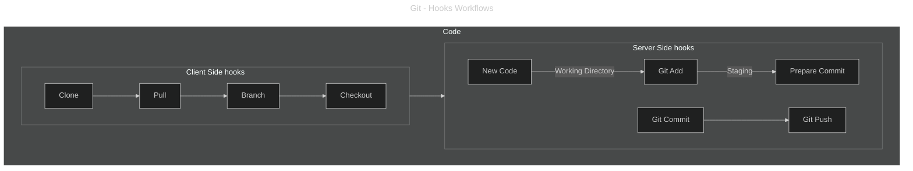

# Pre-Commit

> Prevention is better than cure
> It is better to stop something bad from happening than it is to deal with it after it has happened.

The phrase is attributed to [Benjamin Franklin](https://en.wikipedia.org/wiki/Benjamin_Franklin), who famously advised the citizens of Philadelphia in the 18th century that "an ounce of prevention is worth a pound of cure," relating it to preventing fires.

The `pre-commit` phase is important because it can prevent security issues before they are ever recoded as part of the git history.

## Git hooks

Git hooks are scripts that are self-executed before or after events like committing, pushing, or receiving. They are categorized into client-side and server-side hooks.

### Server-Side Hooks

Server-side hooks resides in server-side repositories (e.g., a central repository, or a developer’s public repository). When attached to the official repository, some of these can serve as a way to enforce policy by rejecting certain commits.

You should also keep in mind that server-side hooks can become very ressources intensive and cause significant security impact.  For these reasons, server-side hooks are rarely use and often prohibited by some vendor.  Yet these exists and the best exemple for such capability is most likely [GitHub: Push Protection](https://docs.github.com/en/code-security/secret-scanning/introduction/about-push-protection), a pre-Receive hooks used as part of GitHub secret scanning feature.

List of server-side hooks

- post-receive: Executed after a successful push, after all refs have been updated. Used for notifications, triggering CI/CD pipelines, etc.
- post-update: Similar to post-receive, but invoked with a list of updated refs.
- pre-receive: Executed when a push is received by the server, before any refs are updated. Used for enforcing policies.
- reference-transaction: Executed during a reference transaction, allowing validation or actions related to ref updates.
- update: Executed once per ref being updated during a push. Allows fine-grained control over which refs are accepted.

### Client-Side Hooks

Client-side hooks are custom scripts that are triggered on a developer's local machine during the Git workflow lifecycle.

They can be found within the `.git/hooks` directory of a local repository and are not automatically copied when cloning a repository.  By default, Git provides examples of how you can use a varities of hooks. Theses exemples are suffix as  `.sample` preventing them from being run.  Removing the suffix will trigger the associated hook automatically during such Git event occurences.

Git hooks script can access large available system wide languages and tool although these are found low level programming langauge such as `bash`, `python`, `perl` and so on.  Given these hooks are not included as part of the repository, `native git hooks` can be cumbersome to share and maintain at scale within an organization.  Each developer needs to set up these hooks individually for each repository or using advance git configuration making these unuseful to manage them across a team.

Several open-source [tool](#tools1) are attempting to simplify such managemnt and distribution.

List of client-side hooks

- applypatch-msg: Invoked by git am to process the commit message of a patch.
- commit-msg: Executed after the user has entered a commit message. Used for validating the message format.
- post-applypatch: Invoked by git am after applying a patch.
- post-checkout: Executed after a git checkout or git switch command has updated the working tree.
- post-commit: Executed after a commit is successfully created.
- post-index-change: Executed after the index is changed by commands like git update-index or git add.
- post-merge: Executed after a successful git merge command.
- post-rewrite: Executed after commands that rewrite history (e.g., git commit --amend, git rebase).
- pre-applypatch: Invoked by git am before applying a patch.
- pre-auto-gc: Executed before Git automatically runs garbage collection.
- pre-commit: Executed before a commit is created. Used for validating code style, running tests, etc.
- pre-merge-commit: Similar to pre-commit, but specifically for merge commits.
- pre-push: Executed before git push attempts to update remote refs.
- pre-rebase: Executed before a rebase operation begins.
- prepare-commit-msg: Executed after the default commit message is created, but before the editor is launched. Allows modification of the message.
- push-to-checkout: Executed on the client side when a git push is performed and the remote repository is configured for push-to-checkout.
- sendemail-validate: Used by git send-email to validate email messages.

## Usages

One of the most useful hooks is the **pre-commit hook**, which, as the name implies, is run right before the commit actually happens, making it possible to automatically run checks on the proposed code (and potentially, reject the changes). Regardless of how many checks you want to run, there can only be one `.git/hooks/pre-commit` executable per repository, which can be a bit cumbersome, especially when you have multiple checks. This is where tools like `pre-commit` or `husky` really shine.

Making sure that there are no secrets in the code, and that the code follows certain guidelines (According to the Linter rules) will result in a higher quality code.

In the following, we take a look into different types of pre-commit actions that are as follows:

1. Secrets Management
2. Linting Code

**Pre-commit** is a git feature that can be leveraged as part of the **shift-left security** approach where the developers are empowered to view the issues in the source code earlier in the SDLC process. When the developer runs a git-commit command to commit the code into their local repository, **pre-commit hook** check can be integrated with a security scanning tool executed to look for code quality issues, hard-coded secrets, insecure code, vulnerable dependencies/opensource libraries, etc..

It is to be noted that pre-commit hooks are at the developer's local repository level and not the remote repository commonly used by all the developers working on the same project/application. In such cases when it's required to prevent security issues before they are submitted to a remote/central (Git) repository **pre-push hook** or **git-push** checks can be configured. Refer: <https://git-scm.com/docs/git-push>

Another alternative approach to scan the source code for security issues (such as hardcoded-secrets, insecure code and vulnerable dependencies/opensource libraries) is the use of **SAST/SCA IDE plugins**. This works together with the IDEs used by developers while they write the code. Whereas, git-commit and git-push actions are used after the code is written by the developer. It is necessary to discern these distinct use-cases in order to implement the proper security controls at various levels based on the requirement.

The following image can give you a better view of what the pre-commit means and why we must consider it.

---

## Tools[^1]

### Open-source

- [githooks](https://git-scm.com/docs/githooks) - Hooks used by Git
- [Husky](https://typicode.github.io/husky/) - Git hooks made easy 🐶 woof!
- [lefthook](https://github.com/evilmartians/lefthook) - Fast and powerful Git hooks manager for any type of projects.
- [Pre-Commit](https://pre-commit.com/) - A framework for managing and maintaining multi-language pre-commit hooks.
- [simple-git-hooks](https://github.com/toplenboren/simple-git-hooks) - A simple git hooks manager for small projects
- [CaptainHook](https://github.com/captainhook-git/captainhook) - Git hooks manager for PHP developers.
- [Git Build Hook Maven Plugin](https://github.com/rudikershaw/git-build-hook) - Install Git hooks and config during a Maven build.
- [Overcommit](https://github.com/sds/overcommit) - A fully configurable and extendable git hook manager.

### Links

- [awesome-git-hooks](https://github.com/CompSciLauren/awesome-git-hooks)
- [Wikipedia - Lint (software)](https://en.wikipedia.org/wiki/Lint_(software))

[^1]: Listed in alphabetical order.
